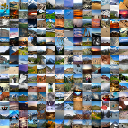
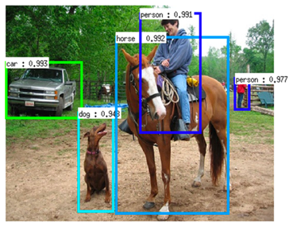
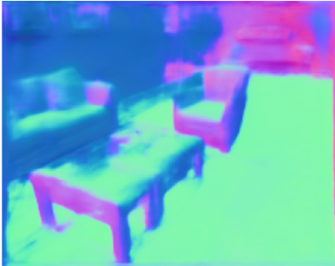
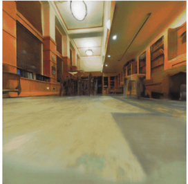

# FAIR Self-Supervision Benchmark

This code provides various benchmark (and legacy) tasks for evaluating quality
of visual representations learned by various self-supervision approaches. This code corresponds to our work on [Scaling and Benchmarking Self-Supervised Visual Representation Learning](https://arxiv.org/abs/1905.01235). The code is written in Python and can be used to **evaluate both PyTorch and Caffe2 models** (see [this](https://github.com/facebookresearch/fair_self_supervision_benchmark/tree/master/extra_scripts#using-pytorch-models)). We hope that this
benchmark release will provided a consistent evaluation strategy that will allow
measuring the progress in self-supervision easily.

## Introduction
The goal of fair_self_supervision_benchmark is to standardize the methodology for evaluating quality of visual representations learned by various self-supervision approaches. Further, it provides evaluation on a variety of tasks as follows:

**Benchmark tasks**: The benchmark tasks are based on principle: a good representation (1) transfers to *many* different tasks, and, (2) transfers with *limited* supervision and *limited* fine-tuning. The tasks are as follows.
- Image Classification
  - [VOC07](http://host.robots.ox.ac.uk/pascal/VOC/pubs/everingham10.pdf)
  - [COCO2014](https://arxiv.org/abs/1405.0312)
  - [Places205](http://places.csail.mit.edu/places_NIPS14.pdf)
- Low-Shot Image Classification
  - [VOC07](http://host.robots.ox.ac.uk/pascal/VOC/pubs/everingham10.pdf)
  - [Places205](http://places.csail.mit.edu/places_NIPS14.pdf)
- Object Detection on [VOC07](http://host.robots.ox.ac.uk/pascal/VOC/pubs/everingham10.pdf) and [VOC07+12](http://host.robots.ox.ac.uk/pascal/VOC/pubs/everingham10.pdf) with frozen backbone for detectors:
  - [Fast R-CNN](https://arxiv.org/abs/1504.08083)
  - [Faster R-CNN](https://arxiv.org/abs/1506.01497)
- [Surface Normal Estimation](https://web.eecs.umich.edu/~fouhey/2013/3dp/index.html)
- Visual Navigation in [Gibson](https://arxiv.org/abs/1808.10654) Environment

<p align="center">
  
  
  
  
</p>

These Benchmark tasks use the network architectures:

- [AlexNet](https://papers.nips.cc/paper/4824-imagenet-classification-with-deep-convolutional-neural-networks.pdf)
- [ResNet50](https://arxiv.org/abs/1512.03385)

**Legacy tasks:** We also classify some commonly used evaluation tasks as legacy tasks for reasons mentioned in Section 7 of [paper](https://arxiv.org/abs/1905.01235). The tasks are as follows:

- [ImageNet-1K](http://www.image-net.org/papers/imagenet_cvpr09.pdf) classification task
- [VOC07](http://host.robots.ox.ac.uk/pascal/VOC/pubs/everingham10.pdf) full finetuning
- Object Detection on [VOC07](http://host.robots.ox.ac.uk/pascal/VOC/pubs/everingham10.pdf) and [VOC07+12](http://host.robots.ox.ac.uk/pascal/VOC/pubs/everingham10.pdf) with full tuning for detectors:
  - [Fast R-CNN](https://arxiv.org/abs/1504.08083)
  - [Faster R-CNN](https://arxiv.org/abs/1506.01497)


## License

fair_self_supervision_benchmark is CC-NC 4.0 International licensed, as found in the LICENSE file.

## Citation

If you use fair_self_supervision_benchmark in your research or wish to refer to the baseline results published in the [paper](https://arxiv.org/abs/1905.01235), please use the following BibTeX entry.

```
@article{goyal2019scaling,
  title={Scaling and Benchmarking Self-Supervised Visual Representation Learning},
  author={Goyal, Priya and Mahajan, Dhruv and Gupta, Abhinav and Misra, Ishan},
  journal={arXiv preprint arXiv:1905.01235},
  year={2019}
}
```

## Installation

Please find installation instructions in [`INSTALL.md`](INSTALL.md).

## Getting Started

After installation, please see [`GETTING_STARTED.md`](GETTING_STARTED.md) for how to run various benchmark tasks.

## Model Zoo

We provide models used in our [paper](https://arxiv.org/abs/1905.01235) in the [`MODEL_ZOO`](MODEL_ZOO.md).

## References

- [Scaling and Benchmarking Self-Supervised Visual Representation Learning](https://arxiv.org/abs/1905.01235). Priya Goyal, Dhruv Mahajan, Abhinav Gupta*, Ishan Misra*. Tech report, arXiv, May 2019.
